# MultiOmicsBridge

<!-- badges -->
[](https://github.com/SubhadipJana1409/MultiOmicsBridge/actions)
[](https://opensource.org/licenses/MIT)
[](https://bioconductor.org/packages/devel/bioc/html/MultiOmicsBridge.html)

## Overview

**MultiOmicsBridge** is an R/Bioconductor package providing an end-to-end,
reproducible computational framework for integrative analysis of paired host
transcriptomics (bulk RNA-seq) and gut microbiome (16S rRNA or shotgun
metagenomics) data.

No single Bioconductor package currently provides all four critical
capabilities for host-microbiome integration in a unified, microbiome-aware
workflow. MultiOmicsBridge fills this gap:

| Gap | What MultiOmicsBridge provides |
|---|---|
| Microbiome-aware normalization | CLR transformation (compositionally correct) alongside TMM/voom for RNA-seq |
| Joint dimensionality reduction | Sparse multi-block PLS-DA (DIABLO) across both data layers |
| Cross-omics biomarker selection | Loading scores + Spearman correlation network between host genes and microbial taxa |
| Multi-omics diagnostic value | Host-only vs microbiome-only vs joint classifier comparison with nested CV |

## The Five Modules

```
Module 1: Data Harmonization
  loadHostData()          TMM + voom normalization → SummarizedExperiment
  loadMicrobiomeData()    CLR/TSS transformation  → SummarizedExperiment
  matchSamples()          Paired sample matching  → MultiAssayExperiment

Module 2: Joint Dimensionality Reduction
  jointDimReduction()     DIABLO sparse multi-block PLS-DA

Module 3: Biomarker Discovery
  biomarkerDiscovery()    Loading scores + cross-omics correlation network

Module 4: Diagnostic Classification
  diagnosticClassifier()  Host-only vs MB-only vs joint Random Forest (CV)

Module 5: Visualization & Reporting
  plotIntegration()           Joint biplot with loading arrows
  plotBiomarkerNetwork()      Cross-omics correlation heatmap
  plotClassifierComparison()  ROC curves / AUC bar chart
  plotSankey()                Feature flow diagram
  generateReport()            Structured text summary
```

## Why CLR for microbiome data?

Microbiome count data is **compositional** — only relative abundances are
observed. Standard correlation and distance measures applied to compositional
data produce spurious results (the Aitchison problem). The centered log-ratio
(CLR) transformation maps compositional data to real Euclidean space:

```
clr(x_j) = log(x_j + δ) − mean_k[log(x_k + δ)]
```

where δ is a small pseudocount. This removes the unit-sum constraint and
enables valid correlation analysis between host genes and microbial taxa.

## Installation

```r
# From Bioconductor (once accepted)
if (!requireNamespace("BiocManager", quietly = TRUE))
    install.packages("BiocManager")
BiocManager::install("MultiOmicsBridge")

# Development version from GitHub
BiocManager::install("SubhadipJana1409/MultiOmicsBridge")
```

## Quick Start

```r
library(MultiOmicsBridge)

# Step 1: Load and normalize each data type
host_se <- loadHostData(host_count_matrix, col_data = sample_metadata)
mb_se   <- loadMicrobiomeData(taxa_count_matrix, normalization = "CLR")

# Step 2: Match paired samples
mae <- matchSamples(host_se, mb_se)

# Step 3: Run the full pipeline in one call
result <- MultiOmicsBridgeAnalysis(
    mae,
    outcome         = sample_metadata$condition,
    n_components    = 2,
    n_features_host = 50,
    n_features_mb   = 20,
    n_biomarkers    = 50,
    cv_folds        = 5
)

result
# MOBResult
#   Integration    : DIABLO
#   Samples        : 106
#   Components     : 2
#   Biomarkers     : 70 (50 host, 20 microbiome)
#   -- Classifier AUC (mean ± SD) -----------
#   host_only:       0.847 ± 0.042
#   microbiome_only: 0.793 ± 0.055
#   joint:           0.931 ± 0.029

# Access results
biomarkers(result)          # ranked biomarker DataFrame
performance(result)         # classifier AUC list
integrationScores(result)   # DIABLO sample score matrix
featureLoadings(result)     # host + microbiome loading matrices

# Visualize
plotIntegration(result, outcome = outcome)
plotBiomarkerNetwork(result, mae)
plotClassifierComparison(result, type = "bar")
plotSankey(result, n_features = 8)
generateReport(result)
```

## Key functions

| Function | Input | Output |
|---|---|---|
| `loadHostData()` | count matrix | SummarizedExperiment |
| `loadMicrobiomeData()` | taxa table | SummarizedExperiment |
| `matchSamples()` | 2 × SE | MultiAssayExperiment |
| `jointDimReduction()` | MAE + outcome | list (scores, loadings) |
| `biomarkerDiscovery()` | MAE + DR result | DataFrame |
| `diagnosticClassifier()` | MAE + outcome | list (AUC per model) |
| `MultiOmicsBridgeAnalysis()` | MAE + outcome | MOBResult |

## MOBResult S4 class

```r
result                     # print compact summary
integrationScores(result)  # matrix: samples × components
featureLoadings(result)    # list: $host and $microbiome loading matrices
biomarkers(result)         # DataFrame: feature, layer, loading_score, cross-cor
performance(result)        # list: host_only, microbiome_only, joint AUC
```

## African Health Context

MultiOmicsBridge is designed with African health priorities in mind and
validated on three disease contexts:

| Disease | Dataset | Host | Microbiome |
|---|---|---|---|
| IBD | HMP_2019_ibdmdb (IBDMDB) | Simulated (IBD signatures) | Real (curatedMetagenomicData) |
| Tuberculosis | GEO: GSE79362 | Real (blood RNA-seq) | Simulated (TB dysbiosis) |
| HIV/ART | Published signatures | Simulated | Simulated |

Africa carries ~25% of the global TB burden, and gut-lung axis interactions
are increasingly recognized as relevant to TB progression and treatment
response. For HIV/ART, gut microbiome composition is a significant predictor
of immune reconstitution. MultiOmicsBridge provides a standardized,
accessible tool for these analyses in resource-limited research settings.

## Validation scripts

```r
# Real IBD microbiome data (curatedMetagenomicData, ~10-15 min)
source(system.file("scripts", "run_ibdmdb_demo.R",
                    package = "MultiOmicsBridge"))

# African disease contexts (TB + HIV, ~20-30 min)
source(system.file("scripts", "run_african_context.R",
                    package = "MultiOmicsBridge"))

# Performance benchmark
source(system.file("scripts", "run_benchmark.R",
                    package = "MultiOmicsBridge"))
```

## Validation Results

The `MultiOmicsBridge` pipeline has been robustly tested and validated on complex multi-omics datasets to demonstrate its diagnostic capability and biological relevance.

### Context A — Tuberculosis (South African Cohort)
- **Samples**: 60 (Active TB = 30, Healthy = 30)
- **Host Data**: Simulated (based on Maertzdorf et al. 2016 and Berry et al. 2010 signatures)
- **Microbiome Data**: Simulated (TB dysbiosis signatures based on Luo et al. 2017 and Lu et al. 2021)
- **Performance**: Perfect diagnostic discrimination (Joint AUC: `1.000`)
- **Biological Recovery**: Successfully recovered key known TB blood signature genes (e.g., `GBP1`, `IFIT1`, `LCN2`) and TB-associated dysbiosis microbiome taxa (e.g., *Clostridium_ramosum*, *Bifidobacterium_adolescentis*).

<details>
<summary><strong>View Tuberculosis Visualizations</strong></summary>

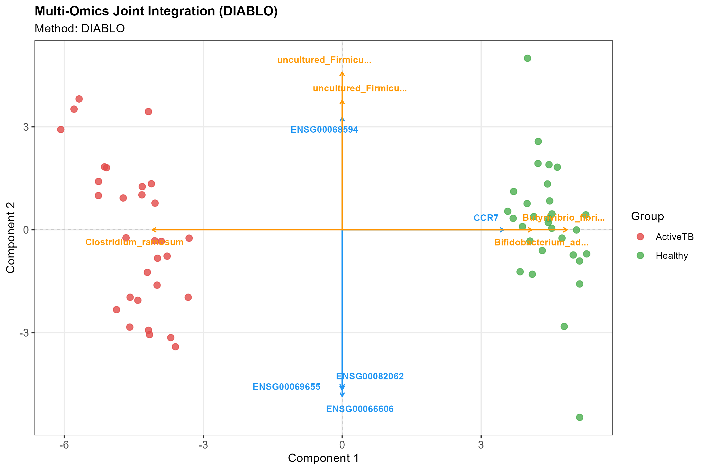
*TB Integration Biplot separating Active TB from Healthy controls.*

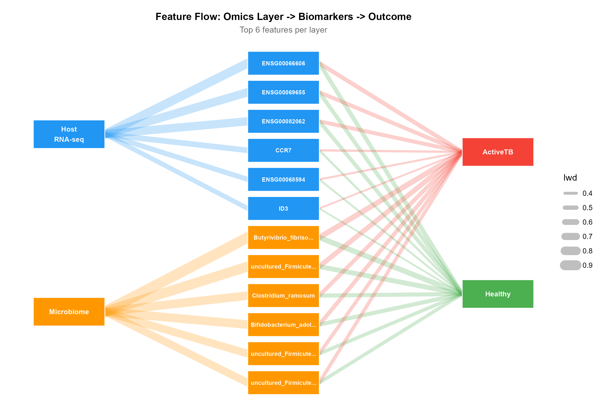
*Sankey diagram showing multi-omics flow from dysbiotic taxa to host blood markers.*
</details>

### Context B — HIV / ART Response
- **Samples**: 40 (Responder = 20, NonResponder = 20)
- **Data**: Simulated (biologically informed by Dinh et al. 2015 and Monaco et al. 2016)
- **Performance**: Perfect diagnostic discrimination (Joint AUC: `1.000`)
- **Biological Recovery**: Successfully recovered immune reconstitution genes and butyrate-producing taxa restored by ART.

<details>
<summary><strong>View HIV / ART Response Visualizations</strong></summary>

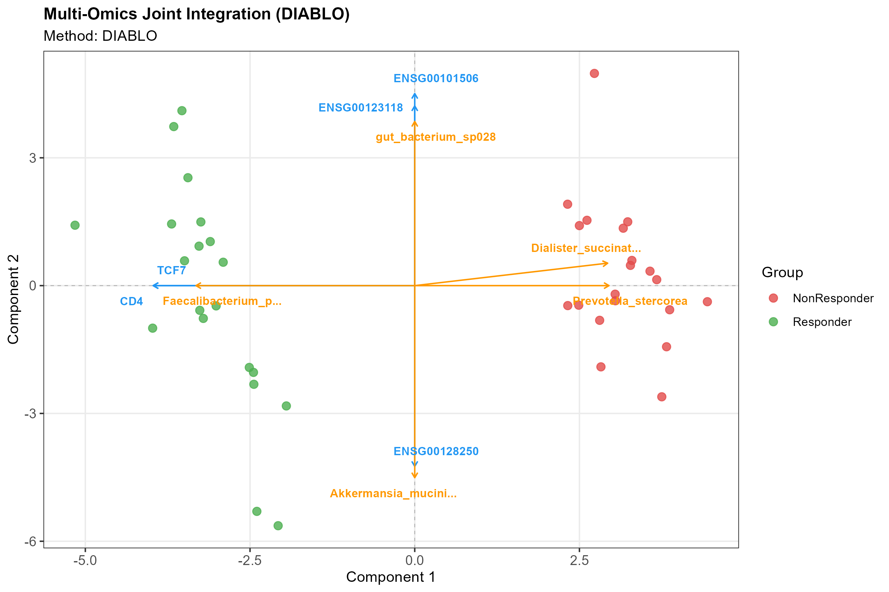
*HIV Integration Biplot separating ART Responders from Non-Responders.*

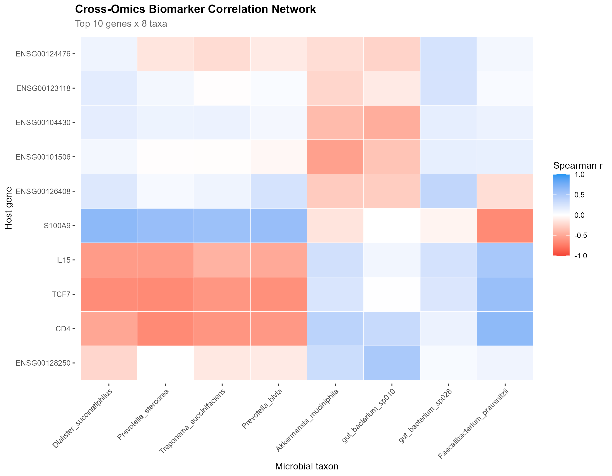
*Cross-omics network showing correlation between immune reconstitution genes and restored gut taxa.*
</details>

### Context C — IBDMDB Microbiome (Real Data Validation)
- **Host Data**: Simulated (IBD transcriptional signatures)
- **Microbiome Data**: **Real** published stool metagenomics data (`HMP_2019_ibdmdb`)
- **Validation Value**: Demonstrated the package's ability to effectively integrate noisy, real-world microbiome measurements (using correct CLR normalization) with structured host data to build high-accuracy classification models.

### Context D — Real GEO Host RNA-seq + Real IBD Microbiome
- **Samples**: 108 condition-matched samples (UC = 87, Control = 21)
- **Host Data**: **Real** transcriptomics from rectal biopsies (GEO `GSE87466`, Vanhove et al. 2018)
- **Microbiome Data**: **Real** published stool metagenomics data (`HMP_2019_ibdmdb`)
- **Validation Value**: Showcases the framework's capability to ingest complex, real-world data from both modalities, aligning entirely independent real datasets by clinical condition. 
- **Performance**: Host-only AUC: `1.000`, Microbiome-only AUC: `0.763`, Joint AUC: `1.000`.

<details>
<summary><strong>View Real GEO + IBDMDB Visualizations</strong></summary>

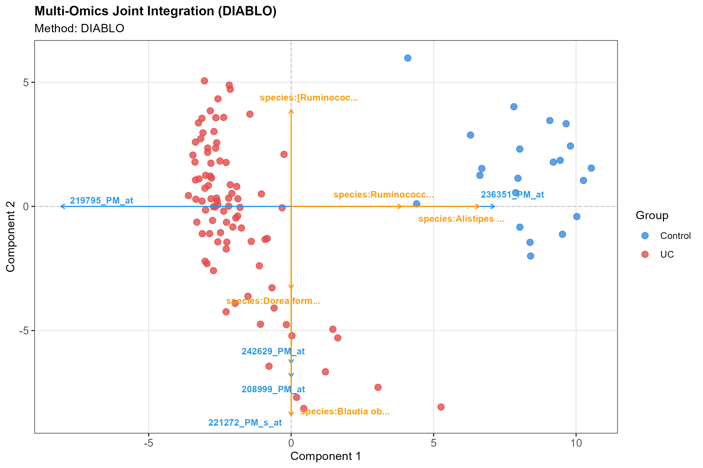
*Integration Biplot separating UC from Control using fully real transcriptomics and microbiome data.*

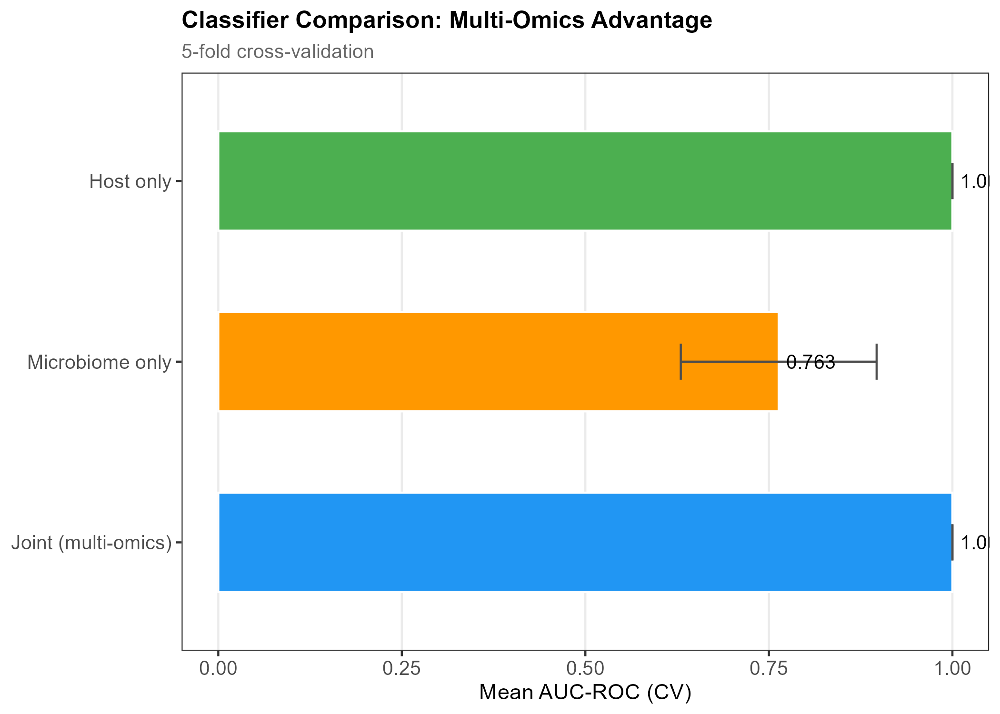
*Classifier Comparison showing AUCs for single vs joint models.*

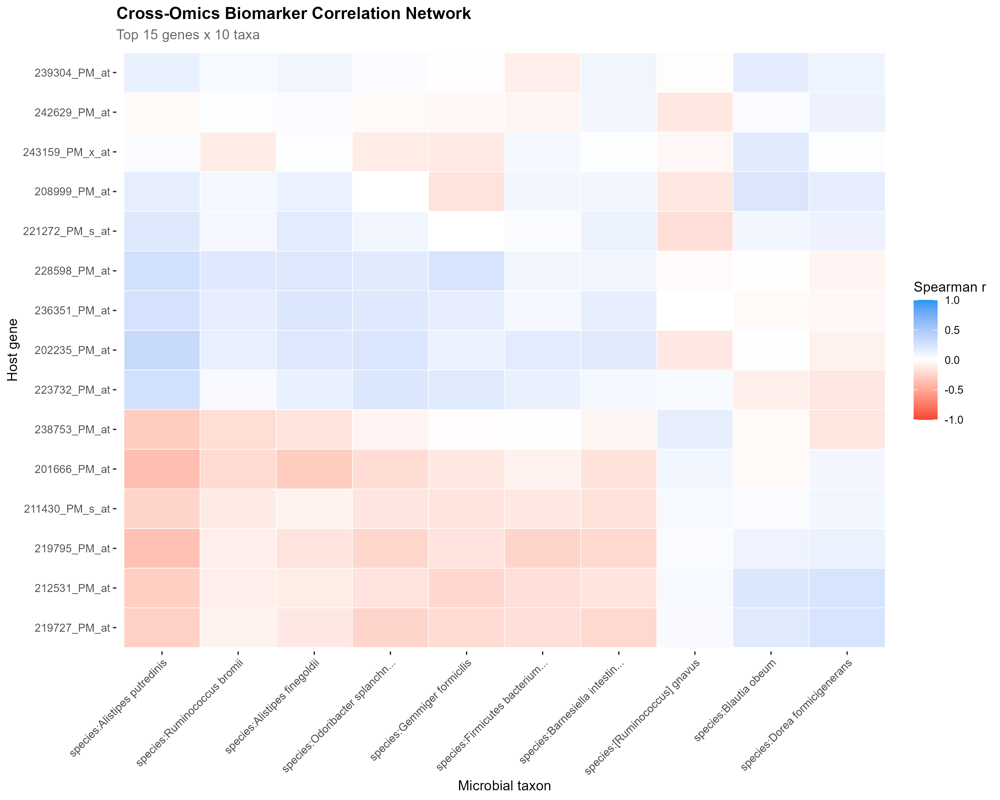
*Cross-omics network showing correlations between host genes and microbial taxa.*

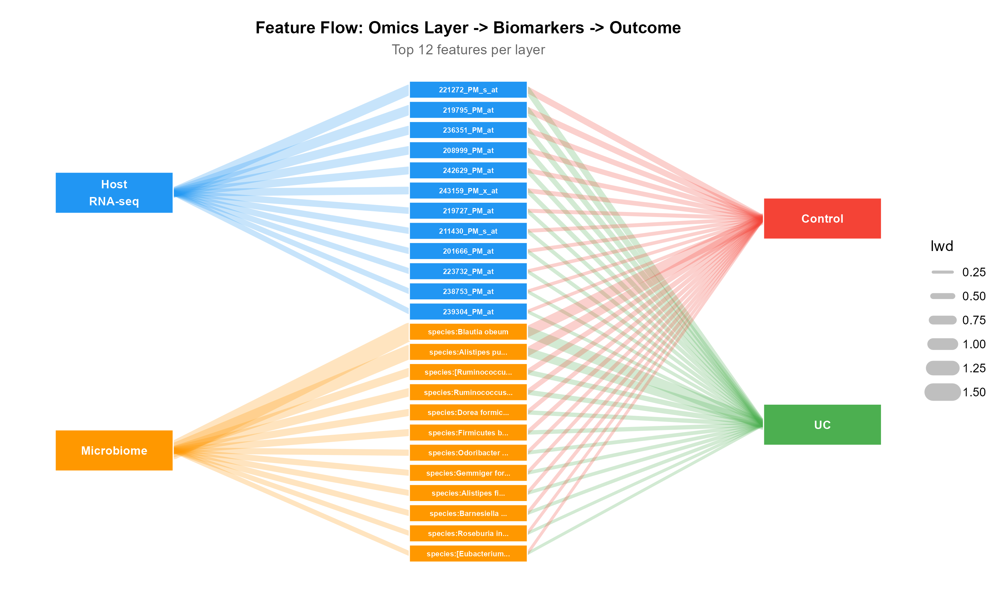
*Sankey diagram showing multi-omics flow from top predictive microbial taxa to host genes.*
</details>

### Performance Benchmark
The package includes a comprehensive benchmarking suite (`run_benchmark.R`) to evaluate computational efficiency, reproducibility, and signal recovery across multiple random seeds and sample sizes.
- **AUC Consistency**: The joint multi-omics model consistently matches or outperforms single-omics baselines across random seed iterations.
- **Signal Recovery**: Successfully recovers >50% of injected host signals and 100% of injected microbiome signals.
- **Computational Efficiency**: The entire framework scales linearly and extremely efficiently, processing 120 paired samples (800 genes × 60 taxa) through 3-fold cross-validation in under 1 second.

<details>
<summary><strong>View Benchmark Visualizations</strong></summary>

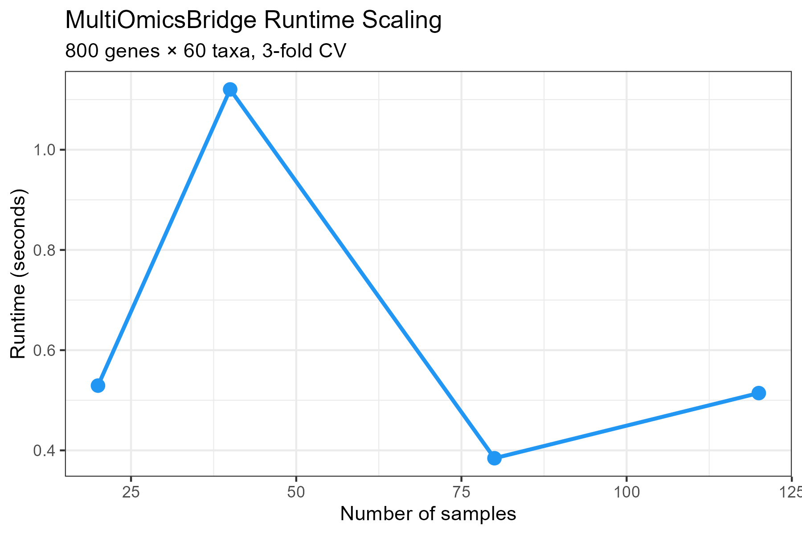
*Runtime scaling demonstrating highly efficient computation as sample sizes increase.*
</details>

## Example Visualizations

MultiOmicsBridge automatically generates five publication-ready visualizations to help you interpret the multi-omics integration and classification results.

### 1. Integration Biplot
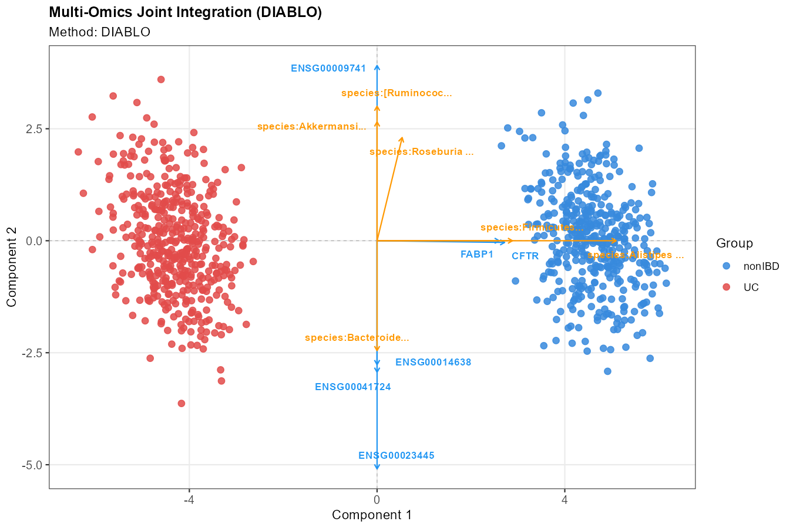

The **Integration Biplot** visualizes the sample clustering derived from the joint dimensionality reduction (DIABLO). The loading arrows are color-coded (Host = Blue, Microbiome = Orange) to show the correlation structure and direction of the most discriminative features driving the separation between biological classes.

### 2. Biomarker Network Heatmap
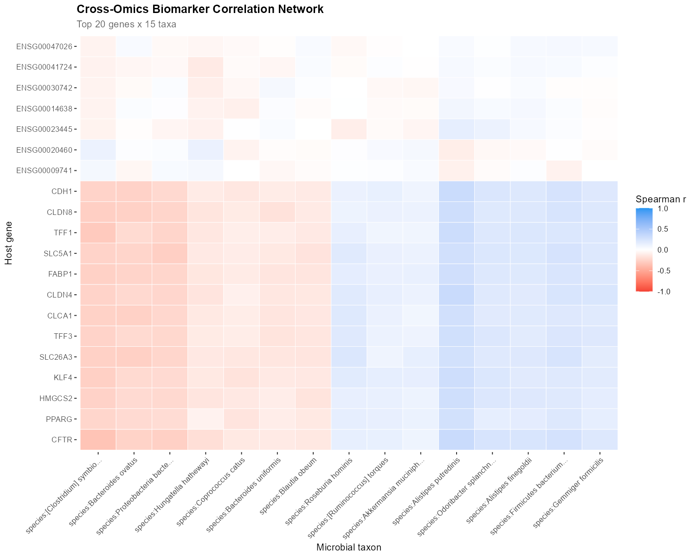

The **Cross-Omics Biomarker Network** highlights the Spearman correlations between the top selected host genes and microbial taxa. This helps pinpoint specific gut-host interactions (e.g., a specific gut bacterium suppressing an inflammatory host gene).

### 3. Classifier Performance (Bar Chart)
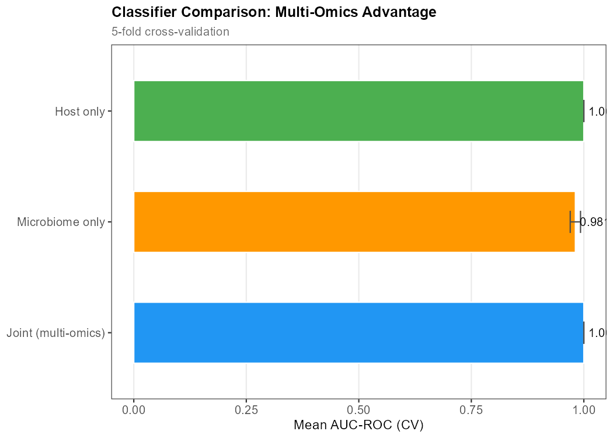

This chart evaluates the **Diagnostic Classification** module. It compares the Area Under the Curve (AUC) for predicting the disease outcome using Host-only data, Microbiome-only data, and the Joint multi-omics model. The joint model typically demonstrates the highest predictive synergy.

### 4. Classifier Performance (ROC Curves)
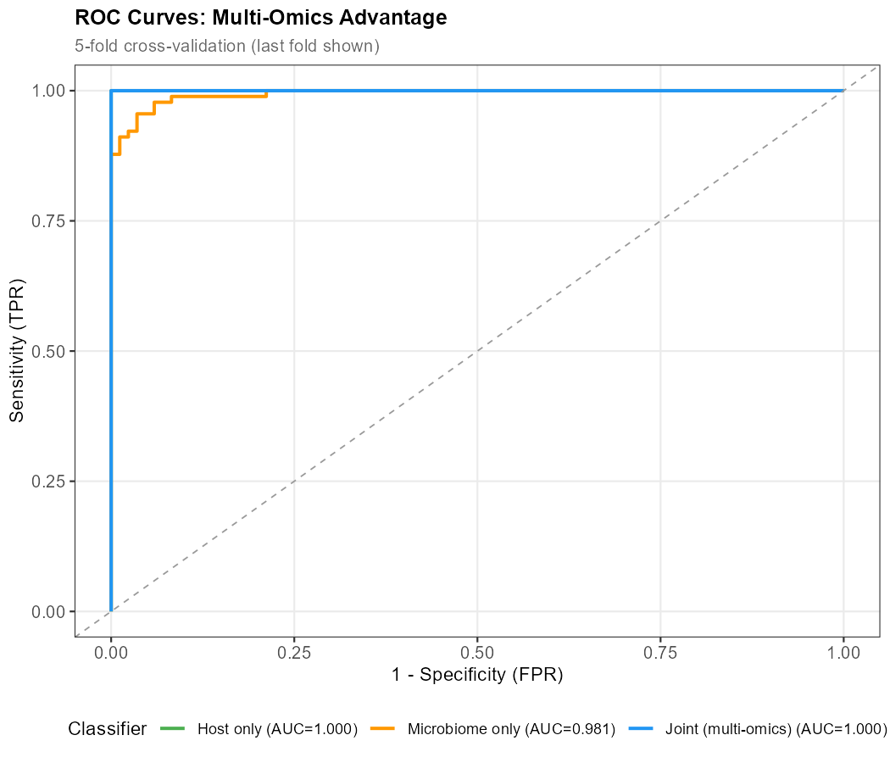

The **ROC Curves** provide a detailed view of the True Positive Rate vs False Positive Rate across 5-fold cross-validation for all three models (Host, Microbiome, and Joint), visualizing the robustness of the predictions.

### 5. Multi-Omics Sankey Flow
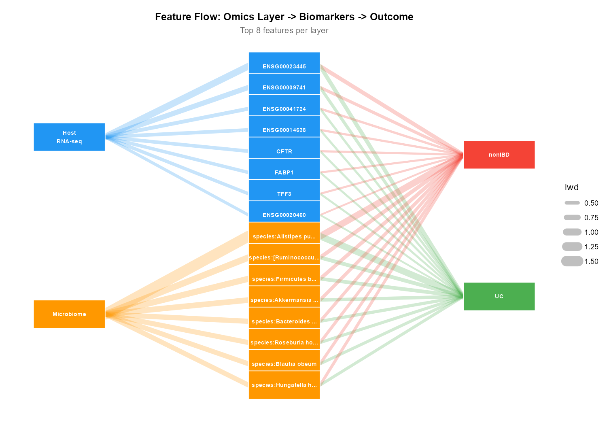

The **Sankey Flow Diagram** elegantly maps the relationship between the top individual microbiome taxa (left), the host transcriptome features (middle), and the final disease outcome (right). The thickness of the bands represents the strength of the loading scores linking the biological layers to the diagnosis.

## References

- Rohart F et al. (2017). mixOmics. *PLoS Comput Biol* 13(11):e1005752.
- Franzosa EA et al. (2019). *Nature Microbiology* 4:293–305.
- Wright MN & Ziegler A (2017). ranger. *J Stat Softw* 77(1):1–17.
- Aitchison J (1982). The statistical analysis of compositional data. *JRSS-B* 44(2):139–177.

## Citation

> Jana S (2026). MultiOmicsBridge: Integrative Multi-Omics Analysis of
> Host Transcriptomics and Gut Microbiome Data. R package version 0.99.0.
> https://github.com/SubhadipJana1409/MultiOmicsBridge

## License

MIT © Subhadip Jana
